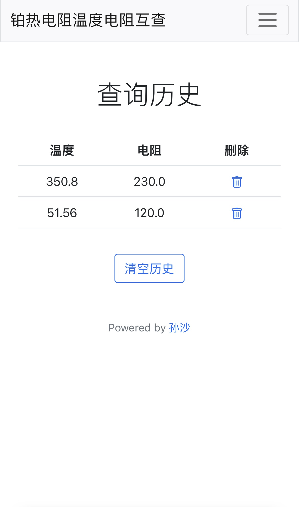
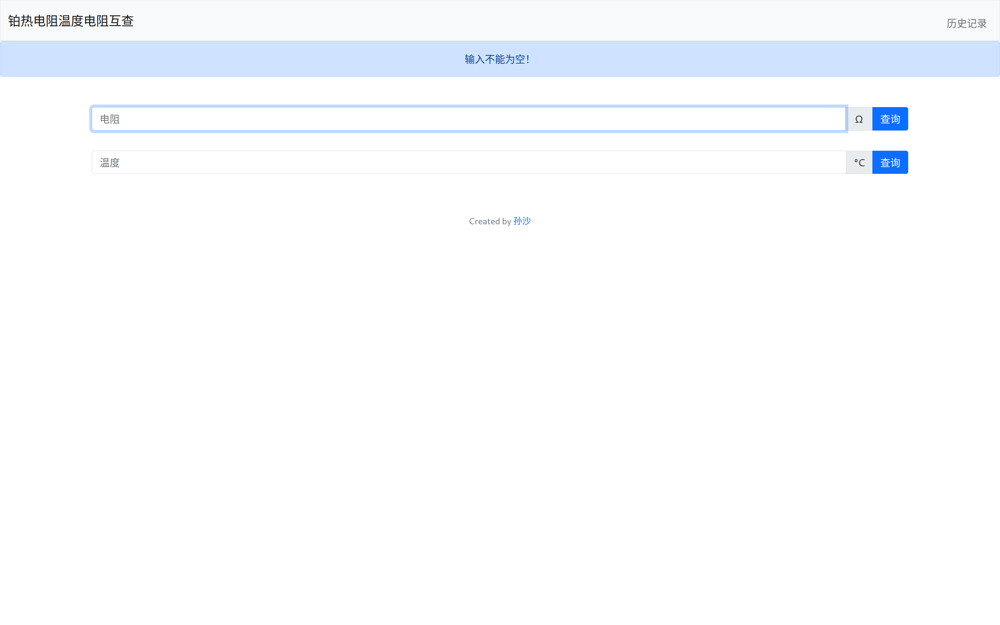
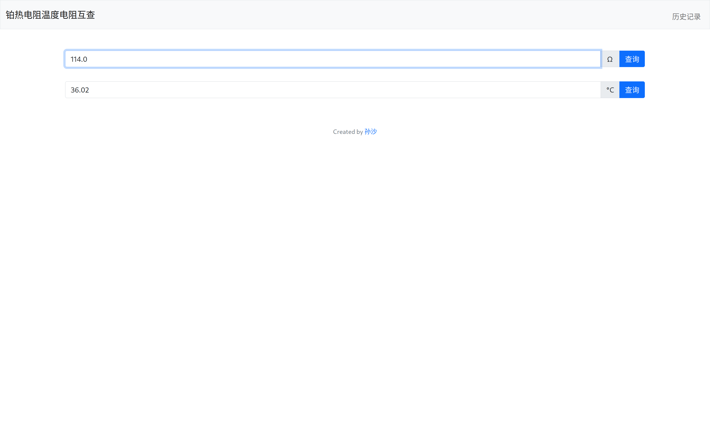
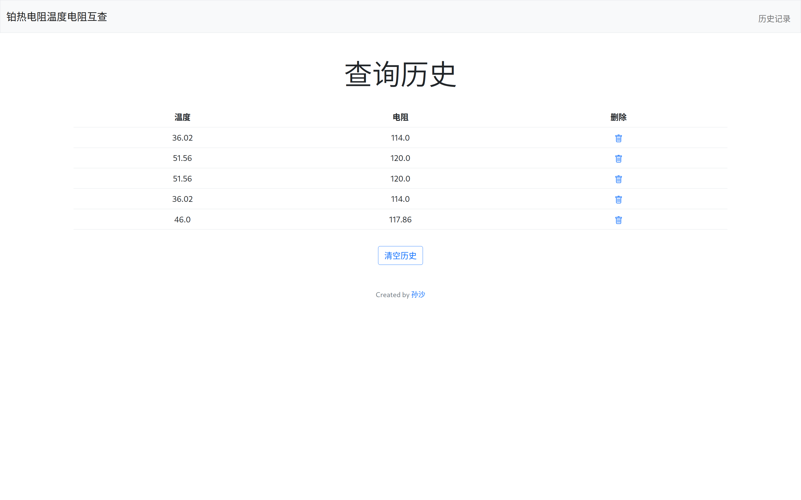

# 铂热电阻温度与电阻互查

简单实现铂热电阻温度与电阻互查。仅作学习用途。`PT100` 分度表[参考此链接](https://itsirl.com/images/references/datasheets/1407280925pt100din.pdf)。

网站地址：http://shane0304.pythonanywhere.com/

> [!WARNING]
> 网站2024年2月18日后无法使用。

## 本地构建

安装依赖
```bash
pip install flask
```
在根目录中运行
```bash
flask run
```
在浏览器中打开`http://localhost:5000`

## TODO
- [x] 前端交互待完善，适应不同尺寸设备，目前在仅在电脑端体验最佳。
- [x] 目前每个人的查找历史都是公开可见的，没有实现数据库隔离。

## 应用截图

### 手机端
<div style="display:inline-block" align=center>
  
  
</div>

### 电脑端




