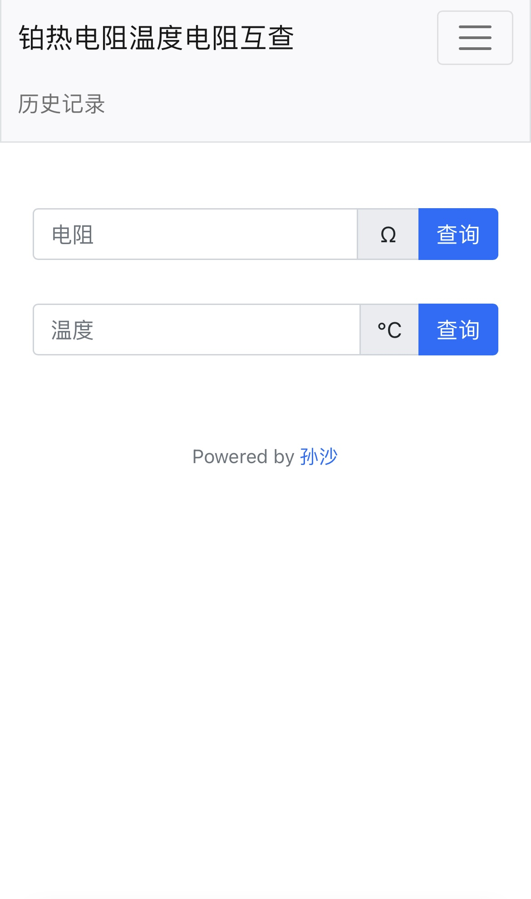

# 铂热电阻温度与电阻互查

简单实现铂热电阻温度与电阻互查。仅作学习用途。`PT100` 分度表[参考此链接](https://file.yizimg.com/175986/200748132954625201334.pdf)。

网站地址：http://shane0304.pythonanywhere.com/

> [!WARNING]
> 网站2024年2月18日后无法使用。

## 本地构建

安装依赖
```bash
pip install flask
```
在根目录中运行
```bash
python3 app.py
```
在浏览器中打开`http://localhost:5000`

## TODO
- [x] 前端交互待完善，适应不同尺寸设备，目前在仅在电脑端体验最佳。
- 目前每个人的查找历史都是公开可见的，没有实现数据库隔离。
- 数据库采用sqlite3，只能处理小规模数据。
- 程序结构待优化。

## 应用截图
<div style="display:inline-block" align=center>
  
  
</div>


